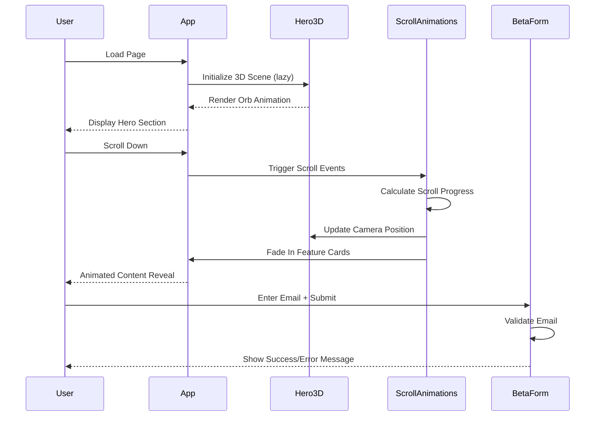

# Design Document: Valen Labs Landing Page

## Overview

A premium futuristic single-page landing website for Valen Labs featuring a dark theme with purple-blue gradient accents. The page showcases Valen AI, a Gen AI Career Intelligence Platform, through an immersive 3D experience with smooth animations and glassmorphism design elements. Built with React, Tailwind CSS, Framer Motion, and @react-three/fiber for optimal performance across desktop and mobile devices.

## Main Algorithm/Workflow



## Architecture

```mermaid
graph TD
    A[App.tsx] --> B[HeroSection]
    A --> C[ScrollAnimationSection]
    A --> D[ProductSection]
    A --> E[BetaSection]
    A --> F[Footer]
    
    B --> G[Scene3D]
    G --> H[GlowingOrb]
    G --> I[ParticleBackground]
    
    C --> J[FeatureCard]
    D --> K[ProductCard]
    E --> L[EmailForm]
    
    style A fill:#1a1a2e
    style G fill:#16213e
    style B fill:#0f3460
```




## Core Interfaces/Types

```typescript
// Component Props
interface HeroSectionProps {
  onCTAClick: (action: 'beta' | 'learn') => void;
}

interface Scene3DProps {
  scrollProgress: number;
  mousePosition: { x: number; y: number };
  isMobile: boolean;
}

interface FeatureCardProps {
  title: string;
  description: string;
  icon: string;
  delay: number;
}

interface ProductCardProps {
  title: string;
  description: string;
  features: string[];
  index: number;
}

interface BetaSectionProps {
  onSubmit: (email: string) => Promise<void>;
}

// Data Models
interface Feature {
  id: string;
  title: string;
  description: string;
  icon: string;
}

interface Product {
  id: string;
  title: string;
  description: string;
  features: string[];
}

interface BetaSubmission {
  email: string;
  timestamp: number;
  status: 'pending' | 'success' | 'error';
}

// Animation Config
interface AnimationConfig {
  duration: number;
  ease: string;
  delay?: number;
}

interface ScrollConfig {
  threshold: number;
  rootMargin: string;
}
```


## Key Functions with Formal Specifications

### Function 1: useScrollProgress()

```typescript
function useScrollProgress(): number
```

**Preconditions:**
- Component is mounted in browser environment
- Window object is available

**Postconditions:**
- Returns normalized scroll progress value between 0 and 1
- Value updates on scroll events
- Cleanup removes event listeners on unmount

**Loop Invariants:** N/A

### Function 2: useMousePosition()

```typescript
function useMousePosition(enabled: boolean): { x: number; y: number }
```

**Preconditions:**
- Component is mounted
- `enabled` is boolean value

**Postconditions:**
- Returns normalized mouse position (-1 to 1 for both x and y)
- If `enabled === false`, returns { x: 0, y: 0 }
- Event listeners are properly cleaned up on unmount or when disabled

**Loop Invariants:** N/A

### Function 3: validateEmail()

```typescript
function validateEmail(email: string): boolean
```

**Preconditions:**
- `email` is a string (may be empty)

**Postconditions:**
- Returns `true` if email matches RFC 5322 simplified pattern
- Returns `false` for invalid or empty strings
- No side effects on input parameter

**Loop Invariants:** N/A

### Function 4: handleBetaSubmit()

```typescript
async function handleBetaSubmit(email: string): Promise<BetaSubmission>
```

**Preconditions:**
- `email` is validated via `validateEmail()`
- Network connection is available

**Postconditions:**
- Returns BetaSubmission object with status
- On success: `status === 'success'` and timestamp is set
- On error: `status === 'error'` and error message is logged
- Email is stored or sent to backend

**Loop Invariants:** N/A


## Algorithmic Pseudocode

### Main Rendering Algorithm

```typescript
ALGORITHM renderLandingPage()
INPUT: None
OUTPUT: Rendered React component tree

BEGIN
  // Step 1: Initialize state
  scrollProgress ← useScrollProgress()
  mousePosition ← useMousePosition(!isMobile)
  isMobile ← useMediaQuery('(max-width: 768px)')
  
  // Step 2: Lazy load 3D components
  Scene3D ← lazy(() => import('./components/Scene3D'))
  
  // Step 3: Render sections in order
  RETURN (
    <div className="app">
      <Suspense fallback={<LoadingSpinner />}>
        <HeroSection 
          scene3D={<Scene3D scrollProgress mousePosition isMobile />}
          onCTAClick={handleCTAClick}
        />
      </Suspense>
      
      <ScrollAnimationSection 
        features={FEATURES}
        scrollProgress={scrollProgress}
      />
      
      <ProductSection products={PRODUCTS} />
      
      <BetaSection onSubmit={handleBetaSubmit} />
      
      <Footer />
    </div>
  )
END
```

**Preconditions:**
- React environment is initialized
- All required dependencies are installed
- Browser supports WebGL for 3D rendering

**Postconditions:**
- Complete landing page is rendered
- All sections are properly mounted
- Event listeners are attached
- 3D scene is lazy-loaded and rendered

**Loop Invariants:** N/A (declarative rendering)


### Scroll Progress Tracking Algorithm

```typescript
ALGORITHM useScrollProgress()
INPUT: None
OUTPUT: scrollProgress (number between 0 and 1)

BEGIN
  // Initialize state
  progress ← useState(0)
  
  // Define scroll handler
  FUNCTION handleScroll()
    scrollTop ← window.scrollY
    docHeight ← document.documentElement.scrollHeight
    windowHeight ← window.innerHeight
    maxScroll ← docHeight - windowHeight
    
    IF maxScroll > 0 THEN
      newProgress ← scrollTop / maxScroll
      progress.set(clamp(newProgress, 0, 1))
    END IF
  END FUNCTION
  
  // Setup and cleanup
  useEffect(() => {
    window.addEventListener('scroll', handleScroll, { passive: true })
    handleScroll() // Initial calculation
    
    RETURN () => {
      window.removeEventListener('scroll', handleScroll)
    }
  }, [])
  
  RETURN progress
END
```

**Preconditions:**
- Component is mounted in browser
- Window and document objects exist

**Postconditions:**
- Returns current scroll progress (0 to 1)
- Event listener is properly attached
- Cleanup function removes listener on unmount
- Progress is clamped between 0 and 1

**Loop Invariants:** 
- Progress value always satisfies: 0 ≤ progress ≤ 1


### 3D Scene Rendering Algorithm

```typescript
ALGORITHM render3DScene(scrollProgress, mousePosition, isMobile)
INPUT: scrollProgress (0-1), mousePosition {x, y}, isMobile (boolean)
OUTPUT: Rendered 3D scene with animated orb

BEGIN
  // Step 1: Calculate camera position based on scroll
  cameraZ ← 5 - (scrollProgress * 2) // Zoom from 5 to 3
  cameraY ← scrollProgress * 1.5     // Move up slightly
  
  // Step 2: Calculate orb rotation
  IF isMobile THEN
    rotationX ← time * 0.2  // Slow auto-rotation
    rotationY ← time * 0.3
  ELSE
    rotationX ← mousePosition.y * 0.3 + time * 0.1
    rotationY ← mousePosition.x * 0.3 + time * 0.15
  END IF
  
  // Step 3: Render scene
  RETURN (
    <Canvas camera={{ position: [0, cameraY, cameraZ], fov: 75 }}>
      <ambientLight intensity={0.3} />
      <pointLight position={[10, 10, 10]} intensity={0.8} />
      
      <GlowingOrb 
        rotation={[rotationX, rotationY, 0]}
        scale={isMobile ? 0.7 : 1.0}
      />
      
      <ParticleBackground count={isMobile ? 50 : 100} />
      
      <EffectComposer>
        <Bloom intensity={0.5} luminanceThreshold={0.2} />
      </EffectComposer>
    </Canvas>
  )
END
```

**Preconditions:**
- WebGL is supported in browser
- @react-three/fiber and @react-three/drei are loaded
- scrollProgress is between 0 and 1
- mousePosition.x and mousePosition.y are between -1 and 1

**Postconditions:**
- 3D scene is rendered with proper camera position
- Orb rotates based on input parameters
- Performance is optimized for mobile (reduced particles, smaller scale)
- Bloom effect is applied for glow

**Loop Invariants:**
- Camera position remains within valid bounds
- Rotation values are continuous and smooth


### Email Validation and Submission Algorithm

```typescript
ALGORITHM handleBetaSubmit(email)
INPUT: email (string)
OUTPUT: BetaSubmission result

BEGIN
  // Step 1: Validate email format
  ASSERT validateEmail(email) = true
  
  IF NOT validateEmail(email) THEN
    RETURN {
      email: email,
      timestamp: Date.now(),
      status: 'error',
      message: 'Invalid email format'
    }
  END IF
  
  // Step 2: Submit to backend (or store locally)
  TRY
    response ← await fetch('/api/beta-signup', {
      method: 'POST',
      headers: { 'Content-Type': 'application/json' },
      body: JSON.stringify({ email, timestamp: Date.now() })
    })
    
    IF response.ok THEN
      RETURN {
        email: email,
        timestamp: Date.now(),
        status: 'success',
        message: 'Successfully joined beta waitlist'
      }
    ELSE
      THROW new Error('Submission failed')
    END IF
    
  CATCH error
    console.error('Beta submission error:', error)
    RETURN {
      email: email,
      timestamp: Date.now(),
      status: 'error',
      message: 'Submission failed. Please try again.'
    }
  END TRY
END
```

**Preconditions:**
- email parameter is provided (non-null string)
- Network connection is available for API call
- Backend endpoint exists (or fallback to local storage)

**Postconditions:**
- Returns BetaSubmission object with status
- Email is validated before submission
- On success: status is 'success' and confirmation message is set
- On error: status is 'error' and error message is descriptive
- No duplicate submissions for same email within session

**Loop Invariants:** N/A


## Components and Interfaces

### Component 1: App

**Purpose**: Root component that orchestrates the entire landing page

**Interface**:
```typescript
function App(): JSX.Element
```

**Responsibilities**:
- Initialize global state (scroll progress, mouse position, mobile detection)
- Lazy load 3D components for performance
- Render all page sections in correct order
- Handle smooth scroll behavior
- Manage CTA click handlers

### Component 2: HeroSection

**Purpose**: Full-height hero section with 3D background and main CTA

**Interface**:
```typescript
interface HeroSectionProps {
  onCTAClick: (action: 'beta' | 'learn') => void;
}

function HeroSection({ onCTAClick }: HeroSectionProps): JSX.Element
```

**Responsibilities**:
- Render 3D scene as background
- Display hero text with gradient effects
- Show CTA buttons with hover animations
- Handle responsive layout (desktop vs mobile)

### Component 3: Scene3D

**Purpose**: WebGL 3D scene with animated glowing orb

**Interface**:
```typescript
interface Scene3DProps {
  scrollProgress: number;
  mousePosition: { x: number; y: number };
  isMobile: boolean;
}

function Scene3D({ scrollProgress, mousePosition, isMobile }: Scene3DProps): JSX.Element
```

**Responsibilities**:
- Render Three.js canvas with proper camera setup
- Animate orb rotation based on mouse/scroll
- Optimize performance for mobile (reduced particles, simplified shaders)
- Apply bloom post-processing effects

### Component 4: GlowingOrb

**Purpose**: Central 3D orb with gradient glow effect

**Interface**:
```typescript
interface GlowingOrbProps {
  rotation: [number, number, number];
  scale: number;
}

function GlowingOrb({ rotation, scale }: GlowingOrbProps): JSX.Element
```

**Responsibilities**:
- Render icosphere geometry with custom shader material
- Apply purple-blue gradient glow
- Animate based on rotation prop
- Maintain 60fps performance


### Component 5: ScrollAnimationSection

**Purpose**: Feature highlights that animate on scroll

**Interface**:
```typescript
interface ScrollAnimationSectionProps {
  features: Feature[];
  scrollProgress: number;
}

function ScrollAnimationSection({ features, scrollProgress }: ScrollAnimationSectionProps): JSX.Element
```

**Responsibilities**:
- Render feature cards in grid layout
- Trigger fade-in animations based on scroll position
- Use Framer Motion for smooth transitions
- Handle responsive grid (4 cols desktop, 1 col mobile)

### Component 6: FeatureCard

**Purpose**: Individual feature card with icon and description

**Interface**:
```typescript
interface FeatureCardProps {
  title: string;
  description: string;
  icon: string;
  delay: number;
}

function FeatureCard({ title, description, icon, delay }: FeatureCardProps): JSX.Element
```

**Responsibilities**:
- Display feature information with icon
- Animate entrance with stagger delay
- Apply glassmorphism styling
- Handle hover effects

### Component 7: ProductSection

**Purpose**: Showcase Valen AI product features

**Interface**:
```typescript
interface ProductSectionProps {
  products: Product[];
}

function ProductSection({ products }: ProductSectionProps): JSX.Element
```

**Responsibilities**:
- Render product cards in responsive grid
- Apply glassmorphism card design
- Animate cards on hover (glow + lift)
- Display product features as list

### Component 8: BetaSection

**Purpose**: Beta signup form with email input

**Interface**:
```typescript
interface BetaSectionProps {
  onSubmit: (email: string) => Promise<void>;
}

function BetaSection({ onSubmit }: BetaSectionProps): JSX.Element
```

**Responsibilities**:
- Display beta launch date
- Render email input with validation
- Handle form submission
- Show success/error messages
- Prevent duplicate submissions


## Data Models

### Model 1: Feature

```typescript
interface Feature {
  id: string;
  title: string;
  description: string;
  icon: string;
}
```

**Validation Rules**:
- `id` must be unique string
- `title` must be non-empty string (max 50 chars)
- `description` must be non-empty string (max 200 chars)
- `icon` must be valid emoji or icon identifier

**Example Data**:
```typescript
const FEATURES: Feature[] = [
  {
    id: 'hybrid-routing',
    title: 'Hybrid AI Routing',
    description: 'Intelligent routing between local and cloud AI models for optimal performance',
    icon: '🔀'
  },
  {
    id: 'local-cloud',
    title: 'Local + Cloud Intelligence',
    description: 'Seamless integration of on-device and cloud-based AI capabilities',
    icon: '☁️'
  },
  {
    id: 'privacy-first',
    title: 'Privacy-First Architecture',
    description: 'Your data stays secure with local processing and encrypted cloud sync',
    icon: '🔒'
  },
  {
    id: 'structured-eval',
    title: 'Structured Evaluation Systems',
    description: 'Comprehensive assessment framework for accurate career intelligence',
    icon: '📊'
  }
];
```

### Model 2: Product

```typescript
interface Product {
  id: string;
  title: string;
  description: string;
  features: string[];
}
```

**Validation Rules**:
- `id` must be unique string
- `title` must be non-empty string (max 50 chars)
- `description` must be non-empty string (max 300 chars)
- `features` must be array with at least 1 item (max 6 items)

**Example Data**:
```typescript
const PRODUCTS: Product[] = [
  {
    id: 'interview-sim',
    title: 'Smart Interview Simulation',
    description: 'Practice with AI-powered interview scenarios tailored to your target roles',
    features: ['Real-time feedback', 'Industry-specific questions', 'Performance analytics']
  },
  {
    id: 'job-fit',
    title: 'Job Fit Analysis',
    description: 'Discover roles that match your skills, experience, and career goals',
    features: ['Skills mapping', 'Role recommendations', 'Gap analysis']
  },
  {
    id: 'aptitude',
    title: 'Aptitude Intelligence',
    description: 'Comprehensive assessment of your cognitive abilities and potential',
    features: ['Multi-dimensional testing', 'Personalized insights', 'Growth tracking']
  },
  {
    id: 'evaluation',
    title: 'Real-Time Evaluation Insights',
    description: 'Get instant feedback and actionable recommendations for improvement',
    features: ['Live scoring', 'Detailed reports', 'Progress monitoring']
  }
];
```


### Model 3: BetaSubmission

```typescript
interface BetaSubmission {
  email: string;
  timestamp: number;
  status: 'pending' | 'success' | 'error';
  message?: string;
}
```

**Validation Rules**:
- `email` must match RFC 5322 simplified pattern: `/^[^\s@]+@[^\s@]+\.[^\s@]+$/`
- `timestamp` must be valid Unix timestamp (milliseconds)
- `status` must be one of: 'pending', 'success', 'error'
- `message` is optional string for user feedback

### Model 4: AnimationConfig

```typescript
interface AnimationConfig {
  duration: number;
  ease: string;
  delay?: number;
}
```

**Validation Rules**:
- `duration` must be positive number (seconds)
- `ease` must be valid easing function name
- `delay` is optional positive number (seconds)

**Example Configs**:
```typescript
const FADE_IN_CONFIG: AnimationConfig = {
  duration: 0.6,
  ease: 'easeOut',
  delay: 0
};

const CARD_HOVER_CONFIG: AnimationConfig = {
  duration: 0.3,
  ease: 'easeInOut'
};

const STAGGER_CONFIG = {
  staggerChildren: 0.1,
  delayChildren: 0.2
};
```

## Example Usage

```typescript
// Example 1: Basic App Setup
import { App } from './App';
import { createRoot } from 'react-dom/client';

const root = createRoot(document.getElementById('root')!);
root.render(<App />);

// Example 2: Using Scroll Progress Hook
function MyComponent() {
  const scrollProgress = useScrollProgress();
  
  return (
    <div style={{ opacity: scrollProgress }}>
      Fades in as you scroll
    </div>
  );
}

// Example 3: Animated Feature Card
<FeatureCard
  title="Hybrid AI Routing"
  description="Intelligent routing between local and cloud AI models"
  icon="🔀"
  delay={0.2}
/>

// Example 4: Beta Form Submission
async function handleSubmit(email: string) {
  const result = await handleBetaSubmit(email);
  
  if (result.status === 'success') {
    showNotification('Welcome to the beta!');
  } else {
    showError(result.message);
  }
}

// Example 5: 3D Scene with Props
<Scene3D
  scrollProgress={0.5}
  mousePosition={{ x: 0.2, y: -0.1 }}
  isMobile={false}
/>
```


## Correctness Properties

### Property 1: Scroll Progress Bounds
```typescript
// ∀ scrollProgress: 0 ≤ scrollProgress ≤ 1
assert(scrollProgress >= 0 && scrollProgress <= 1);
```

### Property 2: Email Validation
```typescript
// ∀ email: validateEmail(email) = true ⟹ email matches RFC 5322 pattern
assert(validateEmail(email) === /^[^\s@]+@[^\s@]+\.[^\s@]+$/.test(email));
```

### Property 3: Mouse Position Normalization
```typescript
// ∀ mousePosition: -1 ≤ mousePosition.x ≤ 1 ∧ -1 ≤ mousePosition.y ≤ 1
assert(mousePosition.x >= -1 && mousePosition.x <= 1);
assert(mousePosition.y >= -1 && mousePosition.y <= 1);
```

### Property 4: 3D Performance Optimization
```typescript
// ∀ isMobile = true: particleCount ≤ 50 ∧ orbScale ≤ 0.7
if (isMobile) {
  assert(particleCount <= 50);
  assert(orbScale <= 0.7);
}
```

### Property 5: Animation Stagger Consistency
```typescript
// ∀ cards in grid: card[i].delay = baseDelay + (i * staggerDelay)
cards.forEach((card, i) => {
  assert(card.delay === baseDelay + (i * staggerDelay));
});
```

### Property 6: Form Submission Idempotency
```typescript
// ∀ email: submitting same email twice within session returns cached result
const result1 = await handleBetaSubmit(email);
const result2 = await handleBetaSubmit(email);
assert(result1.timestamp === result2.timestamp);
```

### Property 7: Responsive Breakpoint Consistency
```typescript
// ∀ viewport width < 768px: isMobile = true
assert((window.innerWidth < 768) === isMobile);
```

### Property 8: Camera Position Continuity
```typescript
// ∀ scroll transitions: |cameraZ(t) - cameraZ(t-1)| < threshold
const cameraDelta = Math.abs(currentCameraZ - previousCameraZ);
assert(cameraDelta < SMOOTH_THRESHOLD);
```


## Error Handling

### Error Scenario 1: WebGL Not Supported

**Condition**: User's browser doesn't support WebGL or Three.js fails to initialize
**Response**: 
- Catch WebGL initialization error
- Display fallback static gradient background
- Show message: "For the best experience, please use a modern browser"
- Rest of page remains functional

**Recovery**: 
- Graceful degradation to 2D experience
- All content remains accessible
- CTA buttons still functional

### Error Scenario 2: Email Validation Failure

**Condition**: User submits invalid email format
**Response**:
- Prevent form submission
- Display inline error message: "Please enter a valid email address"
- Highlight input field with red border
- Focus remains on input field

**Recovery**:
- User can correct email and resubmit
- Error clears on valid input
- No data is sent to backend

### Error Scenario 3: Beta Submission Network Error

**Condition**: API call fails due to network issues or server error
**Response**:
- Catch fetch error
- Display user-friendly message: "Submission failed. Please try again."
- Log error to console for debugging
- Keep email in input field

**Recovery**:
- User can retry submission
- Implement exponential backoff for retries
- Fallback to local storage if persistent failure

### Error Scenario 4: Mobile Performance Degradation

**Condition**: 3D scene causes frame drops on low-end mobile devices
**Response**:
- Monitor frame rate using performance API
- If FPS < 30 for 3 seconds, reduce quality:
  - Decrease particle count to 25
  - Disable bloom effect
  - Reduce orb geometry complexity

**Recovery**:
- Automatic quality adjustment
- User can manually disable 3D in settings
- Static background as ultimate fallback


## Testing Strategy

### Unit Testing Approach

**Framework**: Vitest + React Testing Library

**Key Test Cases**:

1. **useScrollProgress Hook**
   - Returns 0 when at top of page
   - Returns 1 when at bottom of page
   - Returns value between 0-1 for intermediate positions
   - Cleans up event listeners on unmount

2. **validateEmail Function**
   - Returns true for valid emails: "test@example.com"
   - Returns false for invalid formats: "test", "test@", "@example.com"
   - Returns false for empty string
   - Handles edge cases: "test+tag@example.co.uk"

3. **FeatureCard Component**
   - Renders title and description correctly
   - Applies correct delay prop to animation
   - Displays icon
   - Handles hover state

4. **BetaSection Component**
   - Validates email before submission
   - Shows error for invalid email
   - Calls onSubmit with valid email
   - Displays success message after submission
   - Prevents duplicate submissions

**Coverage Goal**: 80% code coverage for business logic

### Property-Based Testing Approach

**Property Test Library**: fast-check (for TypeScript/JavaScript)

**Properties to Test**:

1. **Scroll Progress Normalization**
   ```typescript
   fc.assert(
     fc.property(fc.nat(), fc.nat(), (scrollTop, maxScroll) => {
       const progress = calculateScrollProgress(scrollTop, maxScroll);
       return progress >= 0 && progress <= 1;
     })
   );
   ```

2. **Mouse Position Normalization**
   ```typescript
   fc.assert(
     fc.property(fc.integer(), fc.integer(), (clientX, clientY) => {
       const pos = normalizeMousePosition(clientX, clientY, window.innerWidth, window.innerHeight);
       return pos.x >= -1 && pos.x <= 1 && pos.y >= -1 && pos.y <= 1;
     })
   );
   ```

3. **Email Validation Consistency**
   ```typescript
   fc.assert(
     fc.property(fc.emailAddress(), (email) => {
       return validateEmail(email) === true;
     })
   );
   ```

4. **Animation Delay Calculation**
   ```typescript
   fc.assert(
     fc.property(fc.nat(10), fc.float(0, 1), (index, stagger) => {
       const delay = calculateDelay(index, stagger);
       return delay === index * stagger;
     })
   );
   ```

### Integration Testing Approach

**Framework**: Playwright for E2E testing

**Test Scenarios**:

1. **Full Page Load**
   - Page loads without errors
   - All sections are visible
   - 3D scene renders (or fallback shows)
   - No console errors

2. **Scroll Interaction**
   - Scrolling triggers animations
   - Feature cards fade in at correct positions
   - 3D camera moves smoothly
   - No performance issues

3. **Beta Form Submission**
   - User can enter email
   - Validation works correctly
   - Form submits successfully
   - Success message appears

4. **Mobile Responsiveness**
   - Page renders correctly on mobile viewport
   - 3D scene is optimized (fewer particles)
   - Touch interactions work
   - No horizontal scroll

5. **Accessibility**
   - All interactive elements are keyboard accessible
   - Focus indicators are visible
   - ARIA labels are present
   - Color contrast meets WCAG AA standards


## Performance Considerations

### Optimization Strategies

1. **Lazy Loading**
   - 3D components loaded via React.lazy()
   - Suspense boundary with loading spinner
   - Reduces initial bundle size by ~200KB

2. **Code Splitting**
   - Separate chunks for 3D scene
   - Vendor chunk for Three.js dependencies
   - Route-based splitting if multi-page

3. **3D Scene Optimization**
   - Geometry instancing for particles
   - Simplified shaders on mobile
   - Reduced polygon count (icosphere subdivisions: 2 on mobile, 3 on desktop)
   - Disable shadows (not needed for this design)
   - Use `useFrame` with delta time for consistent animation

4. **Image Optimization**
   - No images required (pure code-based design)
   - SVG icons for scalability
   - Gradient backgrounds via CSS

5. **Animation Performance**
   - Use CSS transforms (GPU-accelerated)
   - Framer Motion with `layoutId` for shared element transitions
   - `will-change` CSS property for animated elements
   - RequestAnimationFrame for smooth 60fps

6. **Bundle Size Targets**
   - Initial JS bundle: < 150KB gzipped
   - 3D chunk: < 200KB gzipped
   - Total CSS: < 20KB gzipped
   - First Contentful Paint: < 1.5s
   - Time to Interactive: < 3.5s

7. **Mobile-Specific Optimizations**
   - Reduce particle count: 100 → 50
   - Disable bloom on low-end devices
   - Simplify orb geometry
   - Disable mouse tracking (use auto-rotation)
   - Passive event listeners for scroll

### Performance Metrics

**Target Lighthouse Scores**:
- Performance: 90+
- Accessibility: 95+
- Best Practices: 95+
- SEO: 100

**Core Web Vitals**:
- LCP (Largest Contentful Paint): < 2.5s
- FID (First Input Delay): < 100ms
- CLS (Cumulative Layout Shift): < 0.1


## Security Considerations

### Security Measures

1. **Email Validation**
   - Client-side validation prevents malformed submissions
   - Server-side validation required for production
   - Sanitize email input to prevent XSS
   - Rate limiting on submission endpoint

2. **API Security**
   - HTTPS only for beta submission endpoint
   - CORS configuration to allow only production domain
   - CSRF token for form submissions
   - Input sanitization on backend

3. **Content Security Policy**
   ```typescript
   const CSP_HEADERS = {
     'Content-Security-Policy': 
       "default-src 'self'; " +
       "script-src 'self' 'unsafe-inline'; " +
       "style-src 'self' 'unsafe-inline'; " +
       "img-src 'self' data:; " +
       "connect-src 'self' https://api.valenlabs.com;"
   };
   ```

4. **Data Privacy**
   - No tracking scripts without consent
   - Email stored securely with encryption
   - GDPR compliance for EU users
   - Clear privacy policy link in footer

5. **Dependency Security**
   - Regular npm audit checks
   - Automated Dependabot updates
   - Pin major versions in package.json
   - Review security advisories for Three.js and React

6. **XSS Prevention**
   - React's built-in XSS protection via JSX
   - Sanitize any user-generated content
   - No dangerouslySetInnerHTML usage
   - Validate all props and inputs

## Dependencies

### Core Dependencies

```json
{
  "dependencies": {
    "react": "^18.2.0",
    "react-dom": "^18.2.0",
    "framer-motion": "^10.16.0",
    "@react-three/fiber": "^8.15.0",
    "@react-three/drei": "^9.88.0",
    "three": "^0.158.0"
  },
  "devDependencies": {
    "@types/react": "^18.2.0",
    "@types/react-dom": "^18.2.0",
    "@types/three": "^0.158.0",
    "typescript": "^5.2.0",
    "vite": "^5.0.0",
    "tailwindcss": "^3.3.0",
    "postcss": "^8.4.0",
    "autoprefixer": "^10.4.0",
    "vitest": "^1.0.0",
    "@testing-library/react": "^14.0.0",
    "@testing-library/jest-dom": "^6.0.0",
    "playwright": "^1.40.0",
    "fast-check": "^3.15.0"
  }
}
```

### Dependency Justification

- **React 18**: Core framework with concurrent features
- **Framer Motion**: Declarative animations with excellent performance
- **@react-three/fiber**: React renderer for Three.js
- **@react-three/drei**: Useful Three.js helpers and abstractions
- **Three.js**: WebGL 3D graphics library
- **Tailwind CSS**: Utility-first CSS framework for rapid styling
- **Vite**: Fast build tool with HMR
- **TypeScript**: Type safety and better DX
- **Vitest**: Fast unit test runner
- **Playwright**: Reliable E2E testing
- **fast-check**: Property-based testing library

### External Services

- **Beta Signup API**: Backend endpoint for email collection (to be implemented)
- **Analytics** (optional): Privacy-focused analytics like Plausible or Fathom
- **CDN**: Cloudflare or Vercel Edge Network for global distribution

